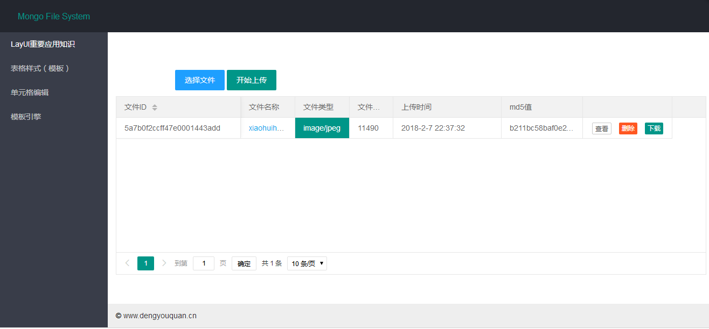

# introduction
A sample file system based on mongo.And you can get docker image.(My English is poor.Excuse me.)
# Effect

# API
+ GET /files : show files.(显示文件列表)
+ GET /files/{id} : download file.(下载文件)
+ GET /view/{id} : show file.(显示文件)
+ POST /upload : Upload file.(上传文件)
+ DELETE /{id} : Delete file.(删除文件)

# Usage
if you use tomcat and jdk.

`java -jar fs-embedmongo.jar`
or
`java -jar fs-mongo.jar`

if you use docker.
>you can build this by docker.
or you can download docker image to <https://dev.aliyun.com>.

`docker pull registry.cn-hangzhou.aliyuncs.com/dengyouquan/git-fs:fs-embedmongo-ubuntu.`

this is a complete image,and it contains embedmongo,you don't need to have a mongodb.

这个镜像是完整的，可以pull下来直接运行，不需要自己去安装一个mongodb.

`docker pull registry.cn-hangzhou.aliyuncs.com/dengyouquan/git-fs:fs-mongo-alpine.`

you need to have a mongodb,and in 27017.Because i use
`spring.data.mongodb.host=www.dengyouquan.cn`,you don't need mongodb.

这个镜像不完整，需要你自己安装mongodb.但是我的配置用了我服务器的mongodb，所以不需要你mongodb.
